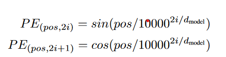
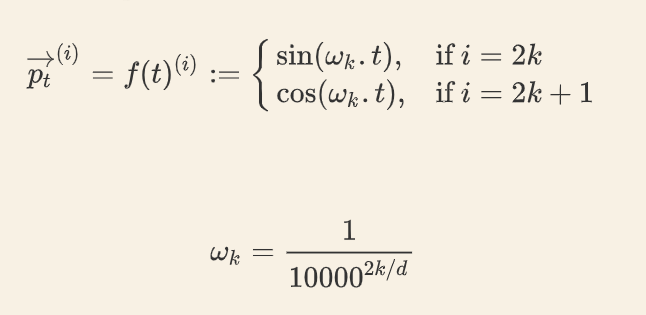
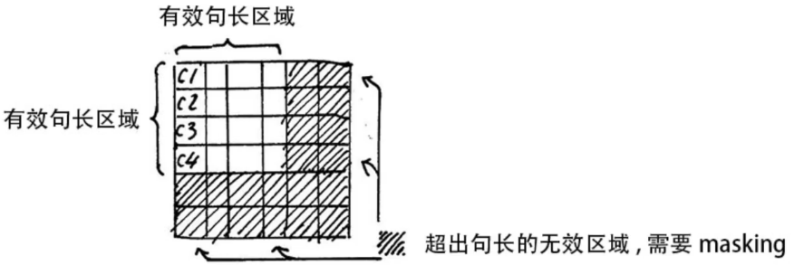
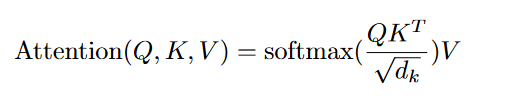
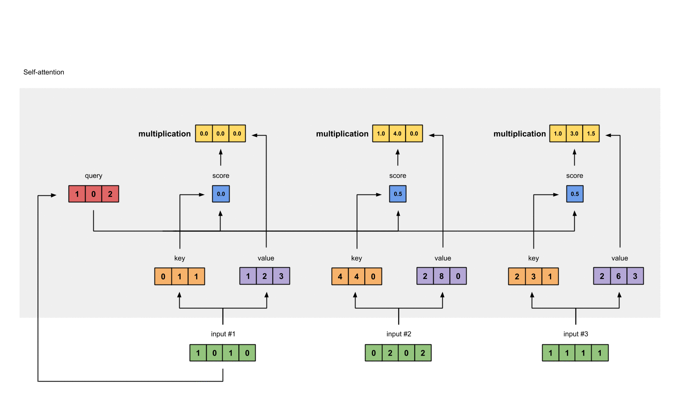

## :high_brightness:Transformer 学习，实现:high_brightness:

还有 pytorch 库中一些函数的用法 tips :>  
[Attension is all you need](https://arxiv.org/abs/1706.03762)
源于[大佬视频讲解](https://www.bilibili.com/video/BV1mk4y1q7eK/?spm_id_from=333.999.0.0&vd_source=744197c073f4828379c29fa20f3ea477)

本 blog 的[代码链接](https://github.com/CyanCat22/transfomer_mini_/tree/main/realize)

**transformer 框架图:point_down:**


### 代码实现

#### 库&参数

```python
import torch.utils.data as Data
import torch
import torch.nn as nn
import math
import numpy as np

# 参数
d_model = 512
d_ff = 2048
d_k = d_v = 64
n_layers = 6  # number of encoder and decoder layers
n_heads = 8
#### Step1 Positional Encoding
```

由于 Transformer 模型没有循环神经网络的迭代操作，所以我们需要提供每个字的**位置信息**给 Transformer，这样它才能识别出语言中的顺序关系  
在 transformer 模型里不训练，在 Bert 模型里会进行训练:collision:
[Positional Encoding 文章理解](https://wmathor.com/index.php/archives/1453/)

- :fire:编码唯一
- :fire:值有界
- :fire:不同长度的句子之间，任何两个字之间的差值应该一致  
    
  

```python
class PositionalEncoding(nn.Module):
    """位置编码"""

    def __init__(self, d_module, dropout=0.1, max_len=5000):
        super(PositionalEncoding, self).__init__()
        self.dropout = nn.Dropout(p=dropout)

        pe = torch.zeros(max_len, d_module)
        # unsqueeze => 在指定位置插入一个新的维度
        position = torch.arange(0, max_len, dtype=torch.float32).unsqueeze(1)
        # (seq_len, batch_size, d_model)
        # 比例因子
        div_term = torch.exp(
            torch.arange(0, d_module, 2).float() *
            (-math.log(10000.0) / d_module)
        )
        # 0::2 切片表达式，索引从零开始，步长为2（隔一个索引取一个）
        pe[:, 0::2] = torch.sin(position * div_term)
        pe[:, 1::2] = torch.cos(position * div_term)

        pe = pe.unsqueeze(0).transpose(0, 1)
        # 将位置编码矩阵注册为一个缓冲区, 避免在每次前向传播时重新计算位置编码
        self.register_buffer("pe", pe)

    def forward(self, x):
        x = x + self.pe[0: x.size(0), :]
        return self.dropout(x)
```

#### Tip1 [torch.unsqueeze()](https://pytorch.org/docs/stable/generated/torch.unsqueeze.html)

=> 在指定位置插入一个维度 扩张维度  
**torch.squeeze()** => 删除张量中大小为 1 的维度
代码示例:point_down:

```python
import torch
a = torch.arange(0, 10)
print(f"向量a1 : {a}, size(a) = {a.size()}")
a = a.unsqueeze(0)
print(f"向量a2 : {a}, size(a) = {a.size()}")
a = a.unsqueeze(0)
print(f"向量a3 : {a}, size(a) = {a.size()}")
a = a.squeeze()
print(f"向量a4 : {a}, size(a) = {a.size()}")
```

#### Tip2 [torch.transpose(dim0, dim1)](https://pytorch.org/docs/stable/generated/torch.transpose.html)

=> 交换两个指定的维度

#### Tip3 register_buffer

#### Step2 Pad_Mask and Subsequence Mask

按照 mini-batch 中最大的句长对剩余的句子进行补齐，一般用 0 进行填充(padding)  
mask 操作，让无效的区域不参与运算，一般是给无效区域加一个很大的负数偏置



```python
def get_attn_pad_mask(seq_q, seq_k):
    batch_size, len_q = seq_q.size()
    print(seq_q.size())
    print(seq_k.size()[0])
    batch_size, len_k = seq_k.size()
    # data.eq(0) 是比较操作，找出序列中所有等于零的元素,返回一个True（即填充（PAD）token），False 表示其他非填充元素
    pad_attn_mask = seq_k.data.eq(0).unsqueeze(1)
    # 根据指定的形状参数沿着指定的维度扩展输入张量
    # print(pad_attn_mask.expand(batch_size, len_q, len_k))
    return pad_attn_mask.expand(batch_size, len_q, len_k)
```

#### Tip4 [torch.eq()](https://pytorch.org/docs/stable/generated/torch.eq.html)

-> A boolean tensor that is True where input is equal to other and False elsewhere  
eg:point_down::

> torch.eq(torch.tensor([[1, 2], [3, 4]]), torch.tensor([[1, 1], [4, 4]]))  
> -> tensor([[[True, False], [False, True]]])

```python
def get_attn_subsequence_mask(seq):
    # 在decoder中用到，屏蔽未来时刻的信息
    attn_shape = [seq.size(0), seq.size(1), seq.size(1)]
    subsequence_mask = np.triu(np.ones(attn_shape), k=1)
    subsequence_mask = torch.from_numpy(subsequence_mask).byte()
    # torch.from_numpy().byte() 将numpy数组转换为Tensor
    return subsequence_mask
```

#### Tip5 [np.triu()](https://numpy.org/doc/stable/reference/generated/numpy.triu.html)

- **np.triu(a, k)** 是取矩阵 a 的上三角数据，但这个三角的斜线位置由 k 的值确定。
- **np.tril(a, k)** 是取矩阵 a 的下三角数据

#### Step3 ScaledDotProductAttention

点积注意力公式:point_down:
  


```python
class ScaledDotProductAttention(nn.Module):
    """缩放点积注意力 单词间的权重计算"""

    def __init__(self):
        super(ScaledDotProductAttention, self).__init__()

    """
        Q: [batch_size, n_heads, len_q, d_k]
        K: [batch_size, n_heads, len_k, d_k]
        V: [batch_size, n_heads, len_v(=len_k), d_v]
        attn_mask: [batch_size, n_heads, seq_len, seq_len]
    """

    def forward(self, Q, K: torch.Tensor, V, attn_mask):
        # 将Q和K的最后一个维度进行点积，在最后一个维度上进行的。
        scores: torch.Tensor = torch.matmul(
            Q, K.transpose(-1, -2)) / np.sqrt(d_k)
        # mask --- qt~qn => 很大的负数
        scores.masked_fill_(attn_mask, -1e9)
        # softmax()高得分接近1，低得分接近0，所有概率之和为1
        attn = nn.Softmax(dim=1)(scores)
        # 再乘值向量得到上下文的权重
        context = torch.matmul(attn, V)

        return context, attn
```

#### Step4 MultiHeadAttention

定义多组，让它们分别关注不同的上下文
也增加了可学习的参数 W_Q, W_K, W_V

```python
class MultiHeadAttention(nn.Module):
    def __init__(self):
        super(MultiHeadAttention, self).__init__()
        self.W_Q = nn.Linear(d_model, d_k * n_heads, bias=False)
        self.W_K = nn.Linear(d_model, d_k * n_heads, bias=False)
        self.W_V = nn.Linear(d_model, d_v * n_heads, bias=False)
        # 将多头注意力的输出进行聚合和转换，将输入维度（batch_size,n_heads*d_v)转换为(~, d_model)
        self.fc = nn.Linear(n_heads * d_v, d_model, bias=False)

    def forward(self, input_Q, input_K, input_V, attn_mask):
        """
        input_Q: [batch_size, len_q, d_model]
        input_K: [batch_size, len_k, d_model]
        input_V: [batch_size, len_v(=len_k), d_model]
        attn_mask: [batch_size, seq_len, seq_len]
        """
        # 残差
        residual, batch_size = input_Q, input_Q.size(0)

        Q = self.W_Q(input_Q).view(batch_size, -1,
                                   n_heads, d_k).transpose(1, 2)
        K = self.W_K(input_K).view(batch_size, -1,
                                   n_heads, d_k).transpose(1, 2)
        V = self.W_V(input_V).view(batch_size, -1,
                                   n_heads, d_k).transpose(1, 2)

        attn_mask = attn_mask.unsqueeze(1).repeat(1, n_heads, 1, 1)
        # 实例化->传递参数
        context, attn = ScaledDotProductAttention()(Q, K, V, attn_mask)
        context = context.transpose(1, 2).reshape(
            batch_size, -1, n_heads * d_v)
        # 全连接映射成一维矩阵
        output = self.fc(context)
        # 残差
        return nn.LayerNorm(d_model).cuda()(output + residual), attn
```

#### Tip6 [torch.matmul()](https://pytorch.org/docs/stable/generated/torch.matmul.html)

Matrix product of two tensors
代码示例:point_down:

```python
import torch

a = torch.arange(6).reshape(2, 3)
b = torch.arange(6).reshape(3, 2)
c = torch.matmul(a, b)
a, b, c
```

    (tensor([[0, 1, 2],
             [3, 4, 5]]),
     tensor([[0, 1],
             [2, 3],
             [4, 5]]),
     tensor([[10, 13],
             [28, 40]]))

#### Tip7 [masked_fill()](https://pytorch.org/docs/stable/generated/torch.Tensor.masked_fill_.html#torch.Tensor.masked_fill_)

Fills elements of self tensor with value where mask is True.  
The shape of mask must be broadcastable with the shape of the underlying tensor.

#### Step5 FeedForward Layer

前馈神经网络  
两次线性变换，RELU 作激活层  
残差连接（防止原始数据丢失）

```python
class PoswiseFeedForwardNet(nn.Module):
    def __init__(self):
        super(PoswiseFeedForwardNet, self).__init__()
        self.fc = nn.Sequential(
            nn.Linear(d_model, d_ff, bias=False),
            nn.ReLU(),
            nn.Linear(d_ff, d_model, bias=False),
        )

    def forward(self, inputs):
        # 残差保存原始输入
        residual = inputs
        output = self.fc(inputs)
        return nn.LayerNorm(d_model).cuda()(output + residual)
```

#### Step6 Encoder

self-attention and feedforward_layer

```python
class EncoderLayer(nn.Module):
    def __init__(self):
        super(EncoderLayer, self).__init__()
        self.enc_self_attn = MultiHeadAttention()
        self.pos_ffn = PoswiseFeedForwardNet()

    def forward(self, enc_inputs, enc_self_attn_mask):
        # K, Q, V, attn_mask
        enc_outputs, attn = self.enc_self_attn(
            enc_inputs, enc_inputs, enc_inputs, enc_self_attn_mask
        )
        enc_outputs = self.pos_ffn(enc_outputs)

        return enc_outputs, attn
```

```python
class Encoder(nn.Module):
    """Encoder Block"""

    def __init__(self):
        super(Encoder, self).__init__()
        # 词嵌入
        self.src_emb = nn.Embedding(src_vocab_size, d_model)
        # 位置编码
        self.pos_emb = PositionalEncoding(d_model)
        # ? 模块列表，包含多个编码器层
        self.layers = nn.ModuleList([EncoderLayer() for _ in range(n_layers)])

    def forward(self, enc_inputs):
        enc_outputs = self.src_emb(enc_inputs)
        enc_outputs = self.pos_emb(enc_outputs.transpose(0, 1)).transpose(0, 1)
        print(enc_outputs)
        enc_self_attn_mask = get_attn_pad_mask(enc_inputs, enc_inputs)
        enc_self_attns = []
        # 循环遍历每一个编码器层，将词向量和自注意力掩码传递给每一个层，获取该层的输出及自注意力权重，并存储在列表中
        for layer in self.layers:
            enc_outputs, enc_self_attn = layer(enc_outputs, enc_self_attn_mask)
            enc_self_attns.append(enc_self_attn)

        return enc_outputs, enc_self_attns
```

#### Step7 Decoder

Masked Multihead attention
Multihead attention
Feedforward network

```python
class DecoderLayer(nn.Module):
    def __init__(self):
        super(DecoderLayer, self).__init__()
        self.dec_self_attn = MultiHeadAttention()
        self.dec_enc_attn = MultiHeadAttention()
        self.pos_ffn = PoswiseFeedForwardNet()

    def forward(self, dec_inputs, enc_outputs, dec_self_attn_mask, dec_enc_attn_mask):
        dec_outputs, dec_self_attn = self.dec_self_attn(
            dec_inputs, dec_inputs, dec_inputs, dec_self_attn_mask
        )
        # ?将 dec_outputs 作为生成 Q 的元素，enc_outputs 作为生成 K 和 V 的元素
        dec_outputs, dec_enc_attn = self.dec_enc_attn(
            dec_outputs, enc_outputs, enc_outputs, dec_enc_attn_mask
        )

        dec_outputs = self.pos_ffn(dec_outputs)

        return dec_outputs, dec_self_attn, dec_enc_attn
```

```python
class Decoder(nn.Module):
    def __init__(self):
        super(Decoder, self).__init__()
        self.tgt_emb = nn.Embedding(tgt_vocab_size, d_model)
        self.pos_emb = PositionalEncoding(d_model)
        self.layers = nn.ModuleList([DecoderLayer() for _ in range(n_layers)])

    def forward(self, dec_inputs, enc_inputs, enc_outputs):
        dec_outputs = self.tgt_emb(dec_inputs)
        dec_outputs = self.pos_emb(
            dec_outputs.transpose(0, 1)).transpose(0, 1).cuda()

        dec_self_attn_pad_mask = get_attn_pad_mask(
            dec_inputs, dec_inputs).cuda()

        dec_self_attn_subsequence_mask = get_attn_subsequence_mask(
            dec_inputs).cuda()
        # torch.gt(a, value),将 a 中各个位置上的元素和 value 比较，若大于 value，则该位置取 1，否则取 0
        dec_self_attn_mask = torch.gt(
            (dec_self_attn_pad_mask + dec_self_attn_subsequence_mask), 0
        ).cuda()

        dec_enc_attn_mask = get_attn_pad_mask(dec_inputs, enc_inputs)

        dec_self_attns, dec_enc_attns = [], []
        for layer in self.layers:
            dec_outputs, dec_self_attn, dec_enc_attn = layer(
                dec_outputs, enc_outputs, dec_self_attn_mask, dec_enc_attn_mask
            )
            dec_self_attns.append(dec_self_attn)
            dec_enc_attns.append(dec_enc_attn)
        return dec_outputs, dec_self_attns, dec_enc_attns
```

#### Tip7 torch.gt()

Computes input > element-wise  
torch.gt(a, value) 的意思是，将 a 中各个位置上的元素和 value 比较，
若大于 value，则该位置取 1，否则取 0

#### Step8 Transformer

```python
class Transformer(nn.Module):
    def __init__(self):
        super(Transformer, self).__init__()
        self.encoder = Encoder().cuda()
        self.decoder = Decoder().cuda()
        self.projection = nn.Linear(d_model, tgt_vocab_size, bias=False).cuda()

    def forward(self, enc_inputs, dec_inputs):
        enc_outputs, enc_self_attns = self.encoder(enc_inputs)
        dec_outputs, dec_self_attns, dec_enc_attns = s = self.decoder(
            dec_inputs, enc_inputs, enc_outputs
        )
        dec_logits = self.projection(dec_outputs)

        return (
            dec_logits.view(-1, dec_logits.size(-1)),
            enc_self_attns,
            dec_self_attns,
            dec_enc_attns,
        )
```

#### Step9 损失函数，优化器

```python
model = Transformer()
# ignore_index=0,不计算pad的损失
criterion = nn.CrossEntropyLoss(ignore_index=0)
optimizer = torch.optim.SGD(model.parameters(), lr=1e-3, momentum=0.99)
```

#### Step11 训练

```python
for epoch in range(30):
    for enc_inputs, dec_inputs, dec_outputs in loader:
        # 存储到gpu中
        enc_inputs, dec_inputs, dec_outputs = (
            enc_inputs.cuda(),
            dec_inputs.cuda(),
            dec_outputs.cuda(),
        )
        outputs, enc_self_attns, dec_self_attns, dec_enc_attns = model(
            enc_inputs, dec_inputs
        )
        loss = criterion(outputs, dec_outputs.view(-1))
        print("Epoch:", "%04d" % (epoch + 1), "loss =", "{:.6f}".format(loss))

        optimizer.zero_grad()
        loss.backward()
        optimizer.step()
```

_分享一个[jupyter 转 md](https://www.zhihu.com/question/556300395)_
